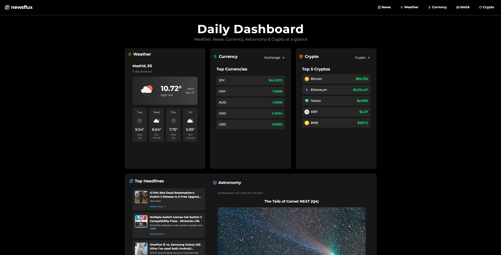

# Newsflux

Newsflux is a full-stack web application that provides news, weather, cryptocurrency, currency exchange rates, and space-related data. It uses a React + Vite frontend and a Flask backend, all served from a single host.

---



---

## Live Demo

[Click here to visit Newsflux](https://news-flux-krxg.onrender.com/)

---

## Tech Stack

Frontend:
- React
- Vite
- Tailwind CSS

Backend:

- Python 3.13
- Flask
- Flask-CORS
- Requests
- Gunicorn (production server)
- dotenv (for environment variables)

APIs Used:

- News API
- Weather API
- Currency Exchange API
- NASA API
- Crypto API

---

## Project Structure
```bash
flask-backend/
├─ app/
│ ├─ __init__.py
│ ├─ controllers/
│ ├─ routes/
│ ├─ utils/
│ ├─ templates/
│ │ └─ index.html # Built React frontend
│ └─ static/
│ └─ assets/ # Vite build assets
├─ run.py # Flask app entrypoint
├─ requirements.txt
frontend/
├─ src/
│ │ └─ App.jsx
│ │ └─ main.jsx
│ │ └─ components/
│ │ └─ lib/
├─ pages/
├─ public
├─ vite.config.js
└─ package.json
```

## Local Setup

1. Clone the repository:

```bash
git clone https://github.com/yourusername/newsflux.git
cd flask-backend
```

```bash
python -m venv venv
source venv/bin/activate      # macOS/Linux
venv\Scripts\activate         # Windows
```

3. Install dependencies
```bash
pip install -r requirements.txt
```

4. Run the app locally
```bash
python run.py
```

## Deployment

- The app is deployed on Render.com
- Frontend and backend are served from a single domain.
- Vite builds are copied into Flask’s templates and static folders.
- Production server runs using Gunicorn.

# License
MIT License
